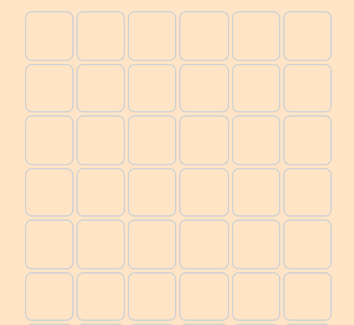

# Color blocks/color charts

I built this to practice bootstrap styling, develop my javascript toward object oriented programming, and to honor some aesthetic principles I admire. In particular, the design and animation are inspired by the painter Gerhard Richter and the late polymath Jonah Adels.

## Bootstrap styling

Bootstrap promises a grid system. So I built one. It only required the simplest building blocks: columns within rows within a parent container. Columns were forced into squares by adding padding rules equating the height with the width designated by the bootstrap column rules:

```
.square{
border-radius: 5px;
border: 1px solid lightgray;
padding-top: 15%;
margin: 1px;
}
```

Looks like this before coloration:



## Javascript practice

Initially, I wrote all of the rows of squares into the HTML and all of the functions into a script at the bottom of the page. But the length became unwieldy. So when I extracted the functions into a script tag, I also added functionality to auto generate the properly classed/attributed objects, though it could still stand to be further refactored:

```
function writeSquares(){
for(var i = 0; i < 50; i++){
  const row = document.createElement('div');
  row.setAttribute('class', 'row container-fluid');;
  container.appendChild(row);

  for(var j = 0; j < 6; j++){
    const square = document.createElement('div');
    square.setAttribute('class', 'square col')
    row.appendChild(square);
  }
}
```

The fun part is the randomness. Math.random functions return of five colors from an area and assign them to a square.

```
var colors = ["#E6A076", "#CC7F5A", "#406E85", "#0F4661", "#F9C850"];
function getRandomColor(){
return colors[Math.floor(Math.random() * Math.floor(5))]
}
function getRandomSquare(){
  return divs[Math.floor(Math.random() * Math.floor(divs.length))]
}
function randomColorReassignment(){
  getRandomSquare().style.background = getRandomColor();
}
```

But then I set randomColorReassignment() to run at three different intervals to keep grid busy, but also strengthens the impression of randomness through time pattern phasing.

```
window.setInterval(randomColorReassignment, 20);
window.setInterval(randomColorReassignment, 17);
window.setInterval(randomColorReassignment, 7);
```

## Aesthetics

I want to build little pages that invite the viewer to think of the internet as an aesthetic medium. I know it's much more than that, but it's cool to think about how it's designed to structure and render things visually. The aesthetic dimension is so significant!

## Acknowledgments
[Jonah Adels](http://environment.yale.edu/news/article/remembering-jonah-adels/)
[Gerhard Richter](https://news.artnet.com/art-world/gerhard-richter-color-charts-turn-50-322319)
Laurel Schwulst's ["My website is a shifting house next to a river of knowledge"](https://thecreativeindependent.com/people/laurel-schwulst-my-website-is-a-shifting-house-next-to-a-river-of-knowledge-what-could-yours-be/)
